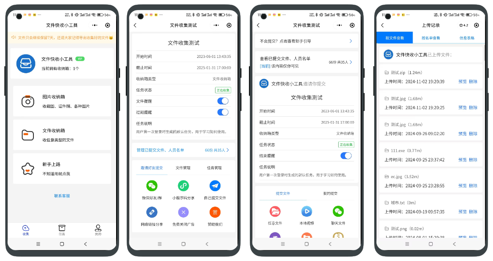

## 文件收集

文件收集是一件很麻烦的事，相信在座的各位很多人都是这样认为的，邮箱收集步骤繁琐，微信收集不好管理，不只这样，还有交错的、没交的、交晚的……好不容易收到手了，发现还得自己整理一遍，总之收集作业、文件，通通都是麻烦事。 但是没法，谁叫咱们接到这个任务了呢！既然要干，咱就得把活干的漂漂亮亮的，干完了还得游刃有余！那到底有什么好办法呢？文件收集小工具来助你一臂之力！



## 演示


您可以扫码上方小程序码或者直接点击（如果点击需要在手机端点击哦）：[https://mini.nicen.cn](https://mini.nicen.cn)，自动跳转到微信小程序进行预览体验！

## 上手

### 1.介绍

* 基于uniapp-cli + vue3 + pinia，UI库为uniapp官方组件库
* 当前代码和小程序线上代码同步，效果别无二致

### 2.运行

当前源码模拟了部分接口，部分页面可直接运行看效果

```shell
npm i -D 
npm run dev:mp-weixin
```

